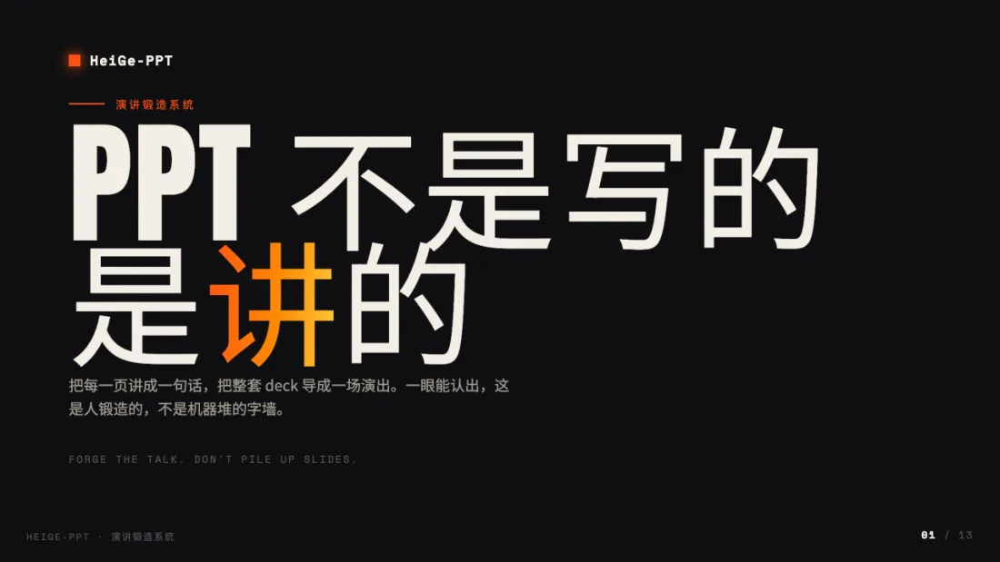
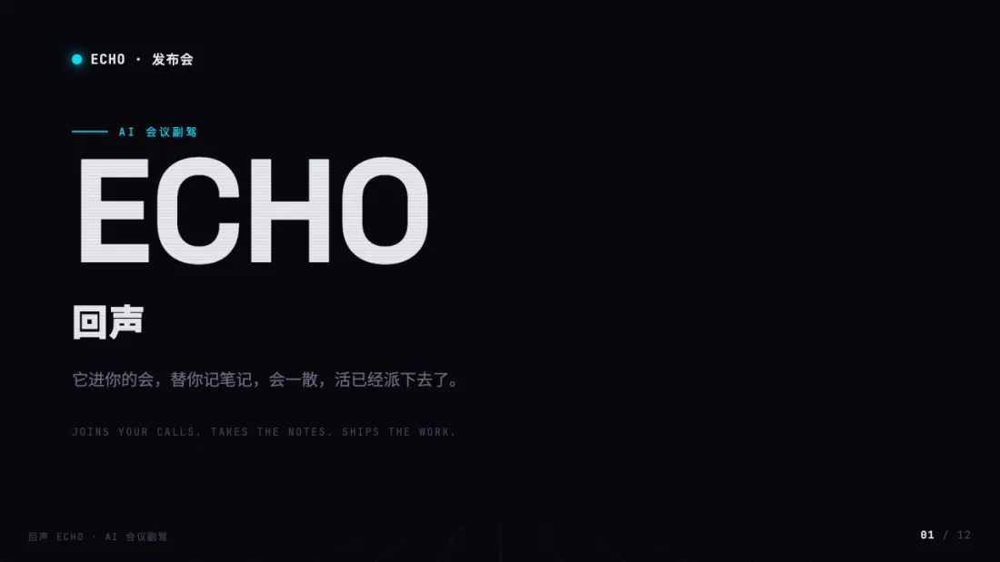
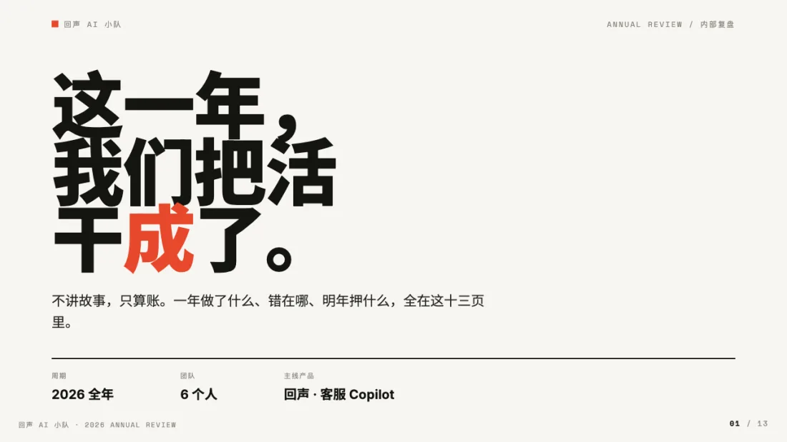
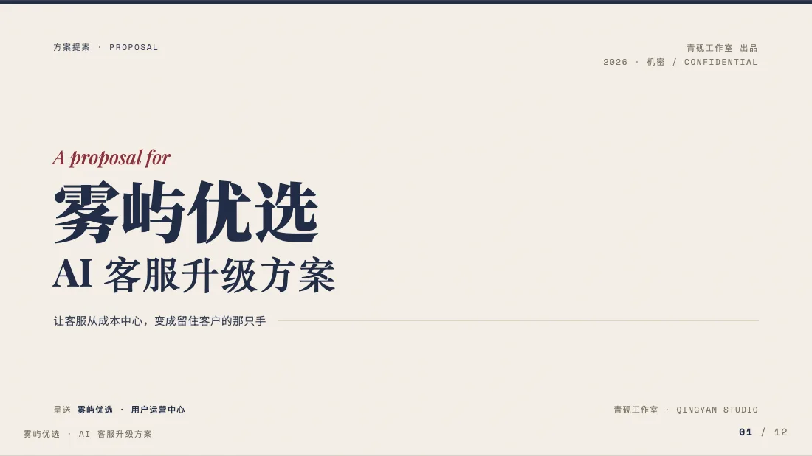
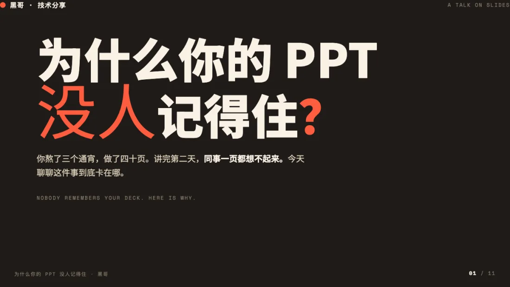

# HeiGe-PPT

<div align="center">


**演讲锻造系统 | Forge the talk, don't pile up slides**

PPT 不是写的，是讲的。

[这是什么](#这是什么-what-is-this) • [方法论](#核心方法论-五道锻造工序) • [样例画廊](#样例画廊-gallery) • [快速开始](#快速开始-quick-start) • [使用指南](#使用指南-usage-guide)

<br>

<a href="https://heigeai.github.io/HeiGe-PPT/examples/heige-pitch.html"></a>

</div>

---

## 这是什么 What is this

让 AI 做出**有气场、有记忆点、敢拿上台讲**的演示 deck。

你肯定见过那种 PPT：标题加三个 bullet，一页接一页，母版一个调子到底。投到屏幕上，观众一边听你念一边走神。讲完了，一页都记不住。因为 AI 只是把要点堆成一面**字墙**。

HeiGe-PPT 不这么干。它把每一页讲成**一句话**，把整套 deck 导成**一场演出**：每页只有一个观点、一个主角、一个让人记住的瞬间。讲完之后，观众能复述出你的主线。

它不是又一个模板套壳，而是一套从真实场景里磨出来的方法论：

- ✅ **五道锻造工序**，每套 deck 都要过一遍
- ✅ **六种极端气质**，每种都给到能直接上手的打法
- ✅ **反 AI 体检清单**，把字墙味摁死在上台前
- ✅ **生产铁律内置**：16:9、键盘翻页、中文不崩、能导出 PDF
- ✅ **打开就能改**：成品自带可编辑层，点「编辑」在浏览器里直接改幻灯片文字，再导出 PDF 或下载独立 HTML，放映翻页和打字不打架
- ✅ **五套跨场景样例**，同一套方法论，做出完全不同的 deck
- ✅ 零依赖单文件，到处都能用

**适用场景**：创业路演、产品发布、年度复盘、方案提案、技术分享、培训课件、述职汇报、招商招生。

**支持平台**：Claude Code、Cursor、Windsurf、Cline、Aider、OpenClaw、Hermes、ChatGPT、Claude.ai 等。

> 别人把要点堆成一摞幻灯片，你把观点导成一场演出。一页一句话，讲完有人记得。

---

## 为什么需要它 Why this matters

| 普通 AI 给你的 PPT | HeiGe-PPT 锻造的 deck |
|---|---|
| 标题加三个 bullet，每页都这结构，观众在读不在听 | 一页一句话，正文给你讲，注意力在你身上 |
| 母版一个调子从头到尾，平铺到尾 | 像一场演出，有开场、铺垫、高潮、收尾 |
| 一页塞两三个观点，没有焦点 | 一页只捧一个主角，扫一眼 3 秒看懂 |
| 通篇纯文字，讲完一页记不住 | 关键观点配视觉锤，讲完记得住那几页 |
| 用「谢谢聆听」草草收场 | 收尾给一个明确行动，观众带着它走 |

---

## 核心方法论 五道锻造工序

做 deck 之前先想清楚：观众从第一页到最后一页，你想带他走一段什么样的路、最后让他做什么动作？排幻灯片的思维问「要讲哪几块」，导演出的思维问「主线是什么、高潮在哪、走的时候记住哪一句」。

### 🗣 01 一页一句话 One Sentence per Slide
每页只讲一个观点，能用一句话说清。讲不完的拆成两页，别挤成字墙。

### ⏱ 02 黄金三秒 The 3-Second Rule
每页投出来，观众扫一眼 3 秒 get 到重点。一页一个视觉主角，字号往大了上，最后一排看得清。

### 🎬 03 节奏编排 Deck Pacing
整套像一场演出：开场抓人 → 痛点 → 转折 → 论证 → 高潮 → 收束行动。封面、金句、数据、过渡、收尾各有版式，别一个母版到尾。

### 🔨 04 视觉锤 Visual Hammer
关键观点配一个让人记住的视觉，像钉子砸进脑子。大数字、强对比、一句占满屏的宣言。整套三五个就够，但必须有。

### 🔍 05 反 AI 体检 Anti-Slop Check
出货前强制过一遍：还是标题加三 bullet 吗？母版套壳吗？有没有一页能被记住？命中任何一条都回去改。这是交付门槛。

完整方法论与使用流程见 [`SKILL.md`](SKILL.md)。

---

## 样例画廊 Gallery

同一套方法论，五种场景气质，做出五套完全不同的 deck。每套都是现场锻造的零依赖单文件，**16:9、键盘 ← → 翻页、Cmd+P 默认横版导出 PDF**。点开任意预览图即可看在线 Demo。

| 预览 | 气质 | 场景 |
|:--:|:--|:--|
| <a href="https://heigeai.github.io/HeiGe-PPT/examples/heige-pitch.html"></a> | **凶悍 / 工业** | HeiGe-PPT 自己的产品路演 |
| <a href="https://heigeai.github.io/HeiGe-PPT/examples/product-keynote.html"></a> | **科技 / 未来** | AI 产品发布会 keynote |
| <a href="https://heigeai.github.io/HeiGe-PPT/examples/annual-review.html"></a> | **克制 / 数据** | 团队年度复盘 |
| <a href="https://heigeai.github.io/HeiGe-PPT/examples/consulting-proposal.html"></a> | **优雅 / 高定** | 给客户的方案提案 |
| <a href="https://heigeai.github.io/HeiGe-PPT/examples/campus-talk.html"></a> | **张扬 / 人文** | 一场技术分享演讲 |

也可以本地预览：
```bash
git clone https://github.com/HeiGeAi/HeiGe-PPT.git
cd HeiGe-PPT && python3 -m http.server 8755
# 浏览器打开 http://localhost:8755/examples/
```

> 翻页：`←` `→` 或 `空格`；回首页 `Home`，到末页 `End`；`Cmd/Ctrl + P` 导出每页一张的 PDF。

---

## 快速开始 Quick Start

### 方法 1：支持 Skill 系统的平台（推荐）

适用于 Claude Code、Cursor、Windsurf、Cline：

```bash
git clone https://github.com/HeiGeAi/HeiGe-PPT.git ~/.claude/skills/heige-ppt
```

然后直接说：

```
用 HeiGe-PPT 做套创业路演 deck，气质凶悍一点
把这份内容做成产品发布 keynote
帮我做个年度复盘，数据要能讲
```

### 方法 2：作为 System Prompt 使用

适用于 ChatGPT、Claude.ai、Aider、OpenClaw、Hermes：

1. 下载本仓库的 `SKILL.md`
2. 将内容粘贴到 AI 助手的 system prompt 或自定义指令中
3. 直接对话使用，无需特殊命令

---

## 使用指南 Usage Guide

HeiGe-PPT 会带你走完整个锻造流程：

1. **定调**：先确认这套 deck 是什么场景、讲给谁、要他们干什么，再挑一个气质方向。
2. **搭主线**：把内容拆成「一页一句话」，连起来读，确认是一条清楚的主线。
3. **编排节奏定视觉锤**：按节奏曲线给每页定功能，标出最关键的三五个观点配视觉锤。
4. **写生产级代码**：16:9 单文件、键盘翻页、中文带字体兜底、可导出 PDF，字号往大了上。
5. **反 AI 体检**：出货前过一遍体检清单，字墙味全部干掉，敢拿上台才交付。

### 场景示例

**做一套创业路演**
```
用 HeiGe-PPT 给我做一套 SaaS 创业路演 deck，给投资人看，气质要硬
```

**把文档变成能讲的 deck**
```
这份方案太长了，用 HeiGe-PPT 帮我做成一套能上台讲的提案
```

**指定气质方向**
```
用 HeiGe-PPT 做个产品发布 keynote，走科技未来风
```

---

## 平台兼容性 Platform Compatibility

HeiGe-PPT 本质是一套让 AI 把 deck 讲清楚、做漂亮的方法论，不绑定任何工具的文件系统或插件能力。**只要这个 AI 能写代码，它就能用 HeiGe-PPT。** 平台之间的差别只有两点：怎么装，以及输出怎么拿到。

| 平台 | 能不能用 | 安装方式 | 输出怎么拿 |
|------|:---:|---------|-----------|
| **Claude Code / Cursor / Windsurf / Cline** | ✅ | 放进 skill 目录 | 自动写成 .html |
| **Aider / OpenClaw / Hermes** | ✅ | 贴进 system prompt | 自动写成 .html |
| **ChatGPT / Claude.ai / 其他 AI** | ✅ | 把 SKILL.md 贴成自定义指令 | 复制代码块，自己存成 .html |

输出是单文件 HTML 幻灯片，浏览器打开即可投屏，Cmd+P 导出 PDF，不依赖任何运行时。

> 提示：深度打法都在 `references/` 里。支持 skill 的平台会按需自动读取；纯贴 prompt 的平台，把 `SKILL.md` 和 `references/` 一起贴上，方法论最完整。

---

## 项目结构 Project Structure

```
HeiGe-PPT/
├── SKILL.md                        # Skill 主文件：方法论 + 使用流程
├── references/                     # 设计资产
│   ├── aesthetic-directions.md     # 六种气质方向库（每种给到具体打法）
│   ├── deck-pacing-templates.md    # 五类 deck 的节奏曲线模板
│   ├── deck-production-spec.md     # 单文件幻灯片硬规格（生产铁律）
│   ├── anti-slop-checklist.md      # 反 AI 体检清单（交付门槛）
│   └── editable-layer.md           # 可编辑层（浏览器里直接改幻灯片文字 + 导出的 drop-in 代码）
├── examples/                       # 同一套方法论 × 五种场景气质
│   ├── heige-pitch.html            # 凶悍/工业 · 产品路演
│   ├── product-keynote.html        # 科技/未来 · 发布会 keynote
│   ├── annual-review.html          # 克制/数据 · 年度复盘
│   ├── consulting-proposal.html    # 优雅/高定 · 方案提案
│   └── campus-talk.html            # 张扬/人文 · 技术分享
├── assets/
│   └── previews/                   # README 用的样例预览图（WebP）
├── LICENSE
├── CHANGELOG.md
└── README.md
```

---

## 版本历史 Version History

完整记录见 [CHANGELOG.md](CHANGELOG.md)。

### v1.1.2 (2026-06-10)
- 🧰 编辑工具栏从左下角挪到右下角页码上方，不再遮挡每套 deck 左下角的品牌标
- 🧹 示例提案去真实实体关联：虚构客户改名「雾屿优选」、联系邮箱改用 `.example` 保留域、加「本案例纯属虚构」声明；示例 CTA 外链全部改为占位链接
- 📦 安装命令改为 `git clone` 直接落到 `~/.claude/skills/heige-ppt`，目录名与 skill name 一致

### v1.1.1 (2026-06-08)
- 🖨 修复导出 PDF 默认竖版的问题：deck 是 16:9 横版，现在 Cmd+P / 编辑层「导出 PDF」默认就是横版，每页一张，不再被塞进竖纸里溢出
- 🎞 五套样例打印底部留白都用各自底色填满（混色 deck 的深色页用 box-shadow 补齐），无白边

### v1.1.0 (2026-06-08)
- ✏️ 可编辑层：每套 deck 打开就能在浏览器里直接改幻灯片文字（点左下角「编辑」），改完导出 PDF 或下载带改动的独立 HTML，改动自动存本地、刷新不丢
- 🎬 放映模式下编辑和方向键翻页不打架（照搬 reveal.js 焦点判断）；工具栏不进 PDF
- 🧩 做成一段 drop-in 代码（`references/editable-layer.md`），贴进 `</body>` 前即生效，deck 和简历共用；五套样例全部带上

### v1.0.0 (2026-05-31)
- 🎉 首次发布
- 🗣 原创方法论「导一场演出」，五道锻造工序：一页一句话 / 黄金三秒 / 节奏编排 / 视觉锤 / 反 AI 体检
- 📐 六种气质方向库 + 五类节奏模板 + 单文件幻灯片生产铁律 + 反 AI 体检清单
- 🎞 五套跨场景样例，16:9 键盘翻页、中文字体兜底、可导出 PDF，全部零依赖单文件

---

## 许可证 License

MIT License，详见 [LICENSE](LICENSE) 文件。

---

## 联系方式 Contact

- **Author**: Blake 黑哥
- **WeChat**: 488137
- **GitHub**: [@HeiGeAi](https://github.com/HeiGeAi)

---

<div align="center">

**如果这个项目对你有帮助，请给个 ⭐️ Star 支持一下！**

Made by Blake 黑哥
讲一场演出，而不是堆一摞幻灯片。

</div>
